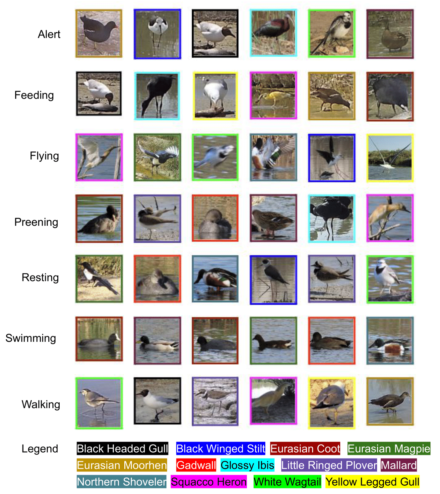

# Visual WetlandBirds Dataset

This is the official repository for 
<br/> **<u>Visual WetlandBirds Dataset: Bird Species Identification and Behaviour Recognition in Videos</u>**
<br/> **Javier Rodriguez-Juan, David Ortiz-Perez, Manuel Benavent-Lledo, David Mulero-Pérez, Pablo Ruiz-Ponce, Adrian Orihuela-Torres, Jose Garcia-Rodriguez and Esther Sebastián-González**
<br/> *University of Alicante*

## Contents

1. [Abstract](#abstract)
2. [Data](#data)
2. [Species classification](#species-classification)
3. [Behavior detection](#behavior-detection)
4. [Troubleshooting](#behavior-detection)
5. [Citation](#citation)
6. [License](#license)
7. [Acknowledgements](#acknowledgements)


## Abstract 

Animal monitoring is a vital field of study, particularly in light of the current biodiversity loss crisis. Data collected through monitoring can provide essential insights and information for decision-making aimed at preserving global biodiversity. Moreover, birds may also respond to human impacts in a more subtle way by modifying their behaviors. Despite the importance of such data, there is a notable scarcity of datasets featuring videos of birds, and no existing dataset offers detailed annotations of bird behaviors in video format. In response to this gap, our study introduces the first fine-grained spatio-temporal dataset specifically designed for bird behavior detection and species classification. This dataset addresses the need for comprehensive bird video datasets and provides detailed data on bird behaviors, facilitating the training of machine learning models to recognize these behaviors, similar to advancements made in human action recognition. The proposed dataset comprises 178 videos recorded in Spanish wetlands, capturing 13 different bird species performing 7 distinct behavior classes.



## Data

All videos and annotations can be downloaded from the official [Zenodo repository](https://doi.org/10.5281/zenodo.14355257). Make sure you download the latest version uploaded. The following table shows the species, number of videos and minutes recorded for each species:

| Common name          | Scientific name                     | Videos | Recorded minutes |
|----------------------|-------------------------------------|--------|------------------|
| Yellow-legged Gull   | *Larus michahellis*                | 13     | 5.08             |
| White wagtail        | *Motacilla alba*                   | 13     | 4.33             |
| Squacco Heron        | *Ardeola ralloides*                | 15     | 4.94             |
| Northern shoveler    | *Spatula clypeata*                 | 14     | 3.49             |
| Mallard              | *Anas platyrhynchos*               | 10     | 2.94             |
| Little-ringed plover | *Charadrius dubius*                | 10     | 1.93             |
| Glossy ibis          | *Plegadis falcinellus*             | 8      | 3.96             |
| Gadwall              | *Mareca strepera*                  | 13     | 2.59             |
| Eurasian moorhen     | *Gallinula chloropus*              | 18     | 9.18             |
| Eurasian magpie      | *Pica pica*                        | 16     | 5.95             |
| Eurasian coot        | *Fulica atra*                      | 19     | 4.11             |
| Black-winged stilt   | *Himantopus himantopus*            | 14     | 3.55             |
| Black-headed gull    | *Chroicocephalus ridibundus*       | 15     | 6.84             |

### Annotations

Annotation data at frame-level is given for each video. Each frame correspond to one line in the CSV annotations, where multiple lines can be associated with a unique frame. Each line corresponds to the annotation of one bounding box appearing in a specific frame of a video. Each bounding box has the next format:

1. Top-left X-coordinate
2. Top-left Y-coordinate
3. Bottom-right X-coordinate
4. Bottom-right Y-coordinate
5. Behavior ID
6. Subject ID (Identifier of a bird within a video)

Additionally, the species of each bounding box is indicated.

### Video samples


https://github.com/user-attachments/assets/b9898b67-ebfd-466d-bb57-3d6821edf0fa


## Species classification

A [species classification](species_classification) baseline based on the YOLOv9 model was developed. The results are shown below:

| Metric    | Result |
|-----------|--------|
| Precision | 0.835  |
| Recall    | 0.759  |
| mAP50     | 0.801  |
| mAP50-95  | 0.556  |

## Behavior detection

A [behavior detection](behavior_detection) baseline based on different video classification models was conducted. The results of the proposed models are presented in the following table:

| Model                    | Learning rate | Accuracy |
|--------------------------|---------------|----------|
| [MViT](https://arxiv.org/abs/2112.01526)          | 0.005         | 0.51     |
| [S3D](https://arxiv.org/abs/1712.04851)           | 0.005         | 0.29     |
| [SwinTransformer](https://arxiv.org/abs/2106.13230) | 0.009       | 0.51     |
| [ResNet](https://arxiv.org/abs/1711.11248)     | 0.003         | 0.56     |

## Troubleshooting

For any kind of problems, please read carefully the extended dataset explanation available in the journal paper. We encourage any user to submit any issue related to the data itself using GitHub's built-in issue system within this repository. 

## Citation

If you use this dataset, please cite:

```
@misc{rodriguez2025wetlandbirds,
title={Visual WetlandBirds Dataset: Bird Species Identification and Behaviour Recognition in Videos},
author={Rodriguez-Juan, Javier and Ortiz-Perez, David and Benavent-Lledo, Manuel and Mulero-Pérez, David and Ruiz-Ponce, Pablo and Orihuela-Torres, Adrian and Garcia-Rodriguez, Jose and Sebastián-González, Esther},
month={dec},
year=2024,
publisher={Zenodo},
doi={10.5281/zenodo.14355257},
url={https://doi.org/10.5281/zenodo.14355257}
}
```

## License

The data from the Visual WetlandBirds dataset is released under the [MIT license](LICENSE).

## Acknowledgements

We would like to thank ”A way of making Europe” European Regional Development Fund (ERDF) and MCIN/AEI/10.13039/501100011033 for supporting this work under the “CHAN-TWIN” project (grant TED2021-130890B- C21 and HORIZON-MSCA-2021-SE-0 action number: 101086387, REMARKABLE, Rural Environmental Monitoring via ultra wide-ARea networKs And distriButed federated Learning. This work is part of the HELEADE project (TSI-100121-2024-24), funded by Spanish Ministry of Digital Processing and by the European Union NextGeneration EU. This work has also been supported by three Spanish national and two regional grants for PhD studies, FPU21/00414, FPU22/04200, FPU23/00532, CIACIF/2021/430 and CIACIF/2022/175.

